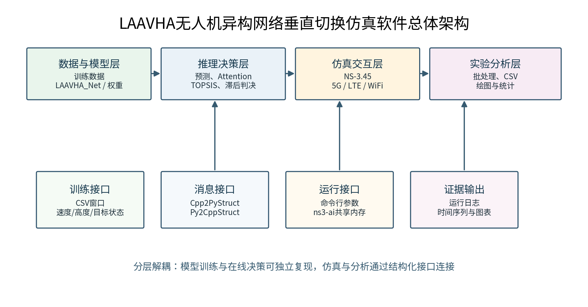
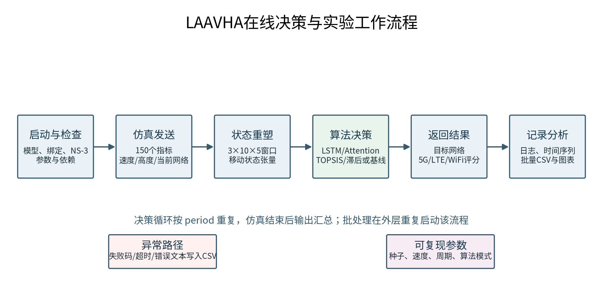
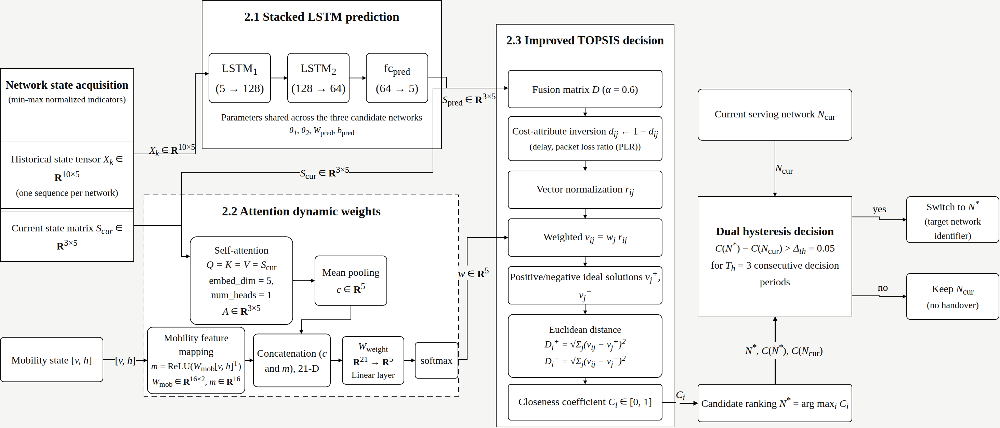
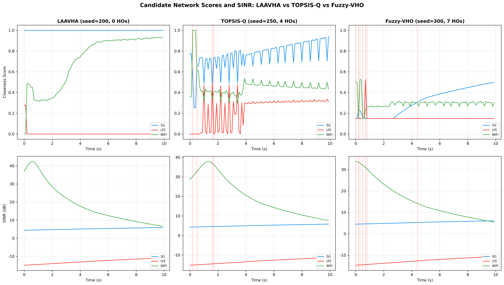
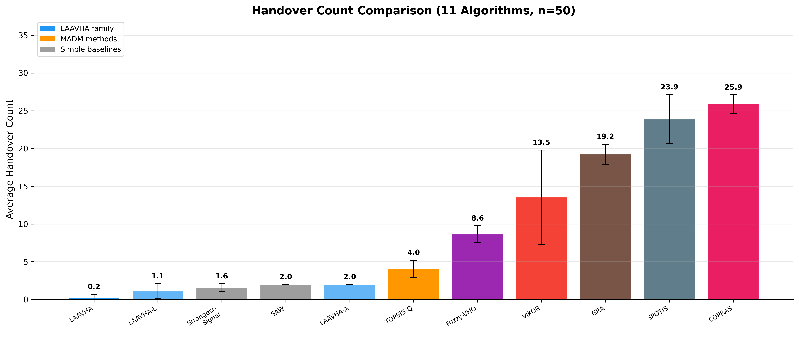

# 无人机遥感异构网络垂直切换智能决策软件 V1.0
## 软件设计说明书（V1.0草案）

> 文档状态：登记材料草案。软件名称、著作权人、开发日期和版本登记信息中的“待确认”字段需在申报前确认。本文档仅描述当前仓库能够证明的实现。

## 1 软件介绍

### 1.1 开发目的

在农田长势巡检、林区火情观察、河湖水面巡查、地质灾害隐患排查和基础设施遥感测绘等任务中，无人机需要在较大空间范围内持续采集图像、视频或传感器数据，并将任务状态和采集结果回传至地面处理端。与定点作业相比，遥感监测无人机通常经历起飞爬升、区域扫描、航线转弯、跨区域巡航和返航等连续飞行阶段。飞行高度、速度、遮挡条件和基站距离不断变化，使可接入的WiFi、5G、LTE等无线网络的信号质量、时延、丢包率和可用带宽随之波动。

遥感数据回传具有连续性需求。若飞行器长期保持在质量下降的服务网络，可能出现监测数据排队、回传中断或控制信息响应不及时；若仅因瞬时信号变化频繁切换，又可能带来重复认证、链路重建和评分抖动等问题。特别是在林地、山地、水域和城乡交错区域，无人机可能在不同网络覆盖边缘快速穿行，当前观测状态与切换完成时的真实状态并不完全一致，固定阈值和单一信号强度判断难以适应这一动态过程。

现有异构网络选择方法常将候选网络指标在单一时刻进行排序，或者采用固定滞后阈值避免乒乓切换。这类方法缺少对短期网络状态演化、飞行速度和服务网络波动的联合考虑：仅依赖当前状态时，难以提前识别即将恶化或改善的链路；仅依赖预测状态时，又可能忽略当前测量的即时变化；固定确认窗口在高速飞行中还可能使初始判断在确认结束前失效。

基于上述场景需求，本软件面向无人机遥感监测中的异构网络垂直切换，建立“状态采集—短期预测—动态加权—候选排序—滞后判决”的处理流程。软件以长短期记忆网络-注意力自适应垂直切换算法（LAAVHA）为基础，融合历史状态预测值和当前状态进行候选网络评价；在排序和判决阶段增加风险敏感排序及自适应动态滞后处理，形成注意力-LSTM增强的风险感知垂直切换算法（ALERA）。软件输出仿真环境中的候选网络评分和决策层切换结果，不改变外部无线接入协议。

### 1.2 面向领域

本软件适用于以无人机为移动采集平台、以无线异构网络为回传条件的遥感监测与通信决策研究场景。典型应用包括农情与林情巡查、水域与海岸线监测、灾害现场态势感知、线路与管廊巡检、地形地貌测绘以及低空遥感通信仿真验证。

在上述场景中，软件不替代飞控系统、相机控制系统或地面图像解译系统，而是面向“飞行过程中选择哪一个候选网络”的决策问题提供算法验证和仿真支撑。输入侧包括各候选网络的历史与当前状态、飞行速度、高度和当前服务网络；输出侧包括候选网络评分、建议目标网络和保持当前网络的判决结果。

### 1.3 软件的主要功能

软件围绕遥感监测无人机的“网络状态—切换决策—仿真记录”流程组织功能。系统从训练数据或仿真消息中接收5G、LTE和WiFi等候选网络的历史指标，并同步接收无人机速度、高度与当前服务网络。每个候选网络采用10个时间步、5类状态指标构成输入窗口，供模型预测和排序模块使用。

其次，软件通过两层堆叠LSTM对各候选网络的下一时刻状态进行预测，并以当前状态构成自注意力输入。注意力表示与速度、高度形成的移动状态表示共同生成五类指标的动态权重；随后，系统将预测状态与当前状态按融合系数组合，对时延和丢包率等成本型指标进行方向统一处理，并使用改进TOPSIS计算各候选网络的贴近度评分。

在切换执行层面，基础模式采用候选目标与当前服务网络的评分差值及连续确认周期构成双重滞后判决。增强模式在近5轮贴近度历史上计算候选网络波动惩罚，得到风险敏感的稳健评分；同时依据当前服务网络近5个周期的SINR波动和飞行速度自适应调整阈值与确认窗口。只有当候选网络在评分优势和连续性条件上均满足要求时，软件才输出切换建议，否则保持当前服务网络。

为便于研究与验证，系统还提供熵权TOPSIS、VIKOR、GRA、COPRAS、SPOTIS、SAW、模糊决策、最大信号、固定网络以及去除LSTM或注意力模块等基线与消融模式。NS-3仿真侧负责构建无人机移动和异构候选网络环境，Python决策侧负责接收状态、计算结果并回传目标网络编号及评分；批处理和绘图模块用于汇总多次运行记录、输出时间序列和生成对比图表。

### 1.4 软件的技术特点

本软件将网络状态的短期预测、当前状态的注意力表征、指标权重自适应学习、多属性排序和滞后判决置于统一的切换链路中。三个候选网络共享预测模型参数，既保证了输入处理和评价结构的一致性，也使不同网络可以在相同决策口径下比较。

与只使用瞬时信号强度或固定指标权重的方法相比，软件以当前状态和预测状态共同参与排序，并使速度和高度参与指标权重生成。因此，切换决策能够反映遥感无人机在不同飞行阶段的移动特征，而不是仅对某一时刻的单项链路指标做出响应。

在切换判决方面，软件采用“评分差值阈值+连续确认周期”的双重滞后机制，限制候选网络单周期排名变化直接触发切换。ALERA进一步通过RS-TOPSIS处理贴近度波动，并通过ADH根据SINR历史波动和飞行速度改变确认条件。该增强路径不改变LSTM和Attention的结构及训练过程，只在排序与判决阶段增加风险和运动状态相关的处理。

## 2 软件开发信息

| 项目 | 内容 |
|---|---|
| 软件名称 | 无人机遥感异构网络垂直切换智能决策软件 V1.0 |
| 版本 | V1.0 |
| 开发完成日期 | [待确认] |
| 著作权人 | [待确认] |
| 开发方式 | 独立开发（待确认） |
| 发表状态 | 未发表（待确认） |

## 3 开发与运行环境

### 3.1 Python环境

软件的模型训练、在线推理、批量实验控制和图表生成在Python环境中完成。Python 3.10或更高版本用于组织训练数据、调用深度学习模型和处理仿真消息；PyTorch用于LSTM与注意力模型的训练和推理；NumPy、Pandas用于多维网络状态、运行记录和CSV数据处理；Matplotlib用于输出切换次数、评分曲线、状态曲线和参数对比图表。

Python侧还依赖`ns3ai_utils`及生成的`ns3ai_laavha_handover_py`模块与NS-3侧进行消息交互。该交互机制将无线网络状态、无人机移动状态和当前服务网络从仿真侧传递至决策侧，再将目标网络编号和候选评分返回仿真侧，从而将遥感飞行过程中的网络变化与智能决策过程连接起来。

### 3.2 C++与仿真环境

软件的场景构建和网络交互运行于NS-3.45环境。C++侧使用WiFi、LTE、Internet、Applications、Mobility、FlowMonitor和Point-to-Point等模块配置候选网络、无人机移动、业务流和运行统计；`contrib/ai`中的ns3-ai模块及pybind11负责构建C++与Python之间的消息接口。

在仿真过程中，C++侧按决策周期组织候选网络指标并写入消息结构，同时记录当前服务网络和无人机移动状态。Python侧完成排序与判决后，C++侧读取返回的网络编号与评分，继续执行后续仿真调度和运行记录。C++侧还可根据`flowmonMode`选择关闭FlowMonitor、仅记录FlowMonitor统计，或将部分FlowMonitor结果馈入决策指标。该分工使通信场景、算法推理和实验分析能够各自独立维护，并以统一接口形成闭环。

C++侧还使用NS-3的netanim模块生成动画轨迹文件，该模块在构建时链接至仿真目标。轨迹文件采用netanim格式，由本软件自带的运行可视化模块直接读取并回放，该模块见第6.3节。选择这一既有格式而非自定义格式，是为了使轨迹文件同时可被同格式的第三方回放工具打开，便于交叉核对；此类第三方工具属于运行环境中的可选组件，不随本软件提交，也不属于本软件的著作权客体。本软件负责的是轨迹文件的生成、其中决策语义的写入，以及对该文件的解析与可视化呈现。

### 3.3 数据与模型依赖

训练阶段需要包含候选网络历史状态、移动状态和目标状态的数据集。训练脚本默认读取`LAAVHA_Training_Dataset.csv`，当前仓库中存在中文文件名训练数据`训练数据集.csv`，二者的映射需在运行前确认或通过副本准备解决。训练完成后生成的模型权重`LAAVHA算法模型.pth`由推理模块加载，用于遥感监测场景下的在线状态预测与动态加权。

模型权重、训练数据和NS-3外部工作区属于运行依赖，不属于本软件源程序正文。运行前需要确认相应文件路径、Python绑定和NS-3仿真目标已经准备完毕；若外部环境不可用，系统应记录为运行环境限制，而不将静态检查结果表述为完整仿真结果。

## 4 软件架构

### 4.1 软件总体架构

软件采用“数据与模型层—推理决策层—仿真交互层—实验分析层”的分层架构。数据与模型层将无线网络的历史观测整理为可训练、可预测的状态窗口；推理决策层将预测结果、当前测量和无人机移动状态转化为候选网络排序与切换结果；仿真交互层持续复现遥感无人机的移动与候选网络覆盖变化；实验分析层对多轮运行过程进行汇总和可视化。四层通过明确的数据输入输出关系形成从网络状态采集到切换结果验证的闭环。

### 4.1.1 数据与模型层

`LAAVHA改进算法训练程序.py`中的`HandoverDataset`将每条样本的前150列重排为3个网络、10个时间步、5个指标的状态张量，将速度和高度作为移动状态，并将目标列重排为3个网络、5个预测指标。`LAAVHA_Net`分别对每个候选网络执行LSTM预测，训练过程采用均方误差损失和Adam优化器，将收敛后的模型状态保存为可供推理加载的参数文件。

该层的作用不是直接决定是否切换，而是从遥感飞行过程中连续变化的网络观测中提取短期趋势，并为后续决策层提供统一维度的预测状态、当前状态和移动状态。这样可避免将不同网络、不同时间尺度的原始指标直接混合比较。

### 4.1.2 推理决策层

`laavha_inference.py`在启动时加载与训练阶段结构一致的`LAAVHA_Net`。每个决策周期内，模块接收150个网络指标值、速度、高度和当前服务网络，首先构造模型输入并得到候选网络的预测状态；随后执行注意力动态加权、预测与当前状态融合、成本型指标转换和TOPSIS排序。

基础LAAVHA根据贴近度评分选择候选目标网络，并通过双重滞后条件判断是否输出切换。增强ALERA在同一预测与注意力结构之上引入风险敏感贴近度和自适应动态滞后参数，使排序结果同时考虑网络评分水平、近周期波动和无人机运动状态。模块最终向仿真侧返回目标网络编号与5G、LTE、WiFi三项评分。

### 4.1.3 仿真交互层

`laavha-handover.cc`负责构建候选网络、无人机移动节点和仿真调度。在遥感监测任务的飞行过程中，模块按照决策周期组织不同网络的链路状态，并将150个指标值、无人机速度、高度与当前服务网络写入`Cpp2PyStruct`。其中5G的SINR和RSRP采用传播代理值；WiFi、LTE及5G的吞吐量、时延和丢包率是否采用FlowMonitor统计，取决于`flowmonMode`及对应场景配置。这些字段组成算法侧每次决策的结构化输入。

Python端完成计算后，C++侧从`Py2CppStruct`读取目标网络编号和三项评分，更新后续服务网络与统计状态。该过程并不替代真实无线网络的attach/detach协议，而是用于在可控的NS-3环境中验证垂直切换决策过程及不同算法的运行差异。

### 4.1.4 实验分析层

`laavha_batch_runner.py`负责组织多次仿真运行，并将持续时间、决策周期、随机种子、移动模型、飞行速度和场景扰动等参数传递至推理服务。每轮运行输出决策次数、切换次数、最终网络和运行状态等记录，便于在相同场景口径下比较不同算法或参数设置。

`laavha_plot.py`读取批处理或时间序列CSV，生成评分变化、SINR变化、切换次数、均值与标准差以及消融对比等图表。该层仅对仿真记录进行汇总和展示，不将未实际测量的吞吐量提升、时延下降、丢包率改善或图像回传完整率作为软件性能结论。

### 4.2 系统流程

软件面向遥感监测飞行过程，按照“准备环境—采集状态—预测排序—判决反馈—汇总分析”的顺序工作。运行开始前，系统检查Python模块、训练权重、NS-3工作区和生成的绑定模块，并根据实验目标设置算法类型、仿真时长、决策周期、随机种子、飞行速度和时间序列输出路径。

飞行仿真开始后，C++侧在每个决策周期采集候选网络的历史指标、无人机速度、高度和当前服务网络；Python侧将这些信息重塑为状态窗口，先完成LAAVHA预测和动态加权，再进行TOPSIS或RS-TOPSIS排序。基础模式使用固定双重滞后条件，增强模式使用由SINR波动和速度计算得到的自适应阈值与确认窗口。

若候选目标网络相对于当前服务网络的评分优势满足阈值，且连续确认条件成立，Python侧返回切换目标；否则返回保持当前网络的结果。C++侧据此继续后续仿真，记录当前网络、目标网络、切换标志和候选评分。任务结束后，批处理模块汇总多轮运行结果，绘图模块生成用于算法对比和参数检查的图表。

## 5 软件的详细设计

### 5.1 数据与模型构建

遥感监测无人机在飞行过程中会同时面对当前网络状态和未来短时间内的网络演化。为避免只依据瞬时测量进行选择，LAAVHA_Net设置预测与权重两个逻辑分支。预测分支以每个候选网络的10个历史时刻、5类指标为输入，依次执行`LSTM(5→128)`、`LSTM(128→64)`和`fc_pred(64→5)`，三个候选网络共享参数，输出预测状态`S_pred`。

权重分支以当前三网络状态`S_cur`作为Self-Attention的`Q=K=V`，其中`embed_dim=5`、`num_heads=1`，再经均值池化得到状态上下文。速度和高度作为模块外部输入，经`fc_mob(2→16)`映射为移动表示；两类表示拼接后，经`fc_weight(21→5)`和Softmax输出五类指标的动态权重。该结构使网络状态与飞行运动特征共同参与评价，而不改变各候选网络的统一预测口径。

### 5.2 改进TOPSIS排序

网络排序阶段先对当前状态和预测状态分别执行按列Min-Max归一化，再以融合系数`α=0.6`构造综合状态矩阵。时延和丢包率属于成本型指标，统一执行`1-x`转换，使五类指标在排序时具有相同的“数值越大越优”方向。

`thesis_topsis`依次完成向量归一化、动态权重相乘、正理想解与负理想解计算、到两类理想解的欧氏距离计算，并获得各候选网络的相对贴近度。贴近度最高的网络被记为候选目标`N*`，但排序结果并不直接触发切换，而是继续进入双重滞后判决，以防止短时评分交叉带来的频繁切换。

### 5.3 双重滞后判决

基础LAAVHA使用候选目标、候选目标贴近度、当前服务网络贴近度和当前服务网络编号作为外部输入。系统比较`C(N*)-C(N_cur)`与阈值`Δ_th=0.05`的关系，并要求该优势连续`T_h=3`个决策周期成立；只有两项条件同时满足时，才切换至`N*`，否则保持`N_cur`。

在遥感无人机仿真飞行过程中，单周期评分可能发生变化。连续确认机制要求候选网络在多个周期内保持评分优势，再输出切换目标；未满足条件时输出保持当前网络。

### 5.4 风险感知增强

ALERA保留LAAVHA的LSTM和Attention结构及训练过程，在排序和判决层面增加风险感知能力。RS-TOPSIS保存各候选网络近`K_c=5`轮贴近度历史，计算标准差`σ_i^C`，并以`C_i^{robust}=C_i-λσ_i^C`形成稳健评分，其中`λ=0.5`。波动较大的网络即使某一周期评分较高，也会在稳健排序中受到相应惩罚。

ADH根据当前服务网络近5个周期的SINR标准差和无人机飞行速度计算双重滞后参数。SINR波动越大，评分优势阈值在`[0.03,0.08]`范围内相应提高；飞行速度越高，确认窗口在`[2,4]`个周期内缩短。该处理根据速度和网络波动改变确认参数，使不同仿真状态下使用的判决条件可被记录和复核。

增强模式的判决输入为`N*`、`C^{robust}(N*)`和`C^{robust}(N_cur)`。仅当两者稳健评分差超过自适应阈值，且连续自适应确认周期成立时，才执行切换；否则保持当前网络。由此形成“预测与当前状态融合—风险敏感排序—自适应滞后—切换或保持”的完整增强路径。

### 5.5 算法伪代码

以下伪代码与训练程序和在线推理程序的当前实现对应。网络编号固定为0=5G、1=LTE、2=WiFi；网络状态指标顺序固定为SINR、RSRP、Delay、Throughput、PLR。

算法1：LAAVHA_Net模型训练

输入：

  D：训练数据集；E：最大训练轮数；eta：学习率；P：早停轮数。

输出：

  M：训练完成的LAAVHA_Net模型权重。

步骤：

1. 读取D，并将每条样本重排为3个候选网络、10个历史时刻和5类指标的状态窗口X。
2. 读取速度、高度组成移动状态m，并将目标列重排为3个网络的下一时刻状态Y。
3. 将样本划分为训练集和验证集，初始化LAAVHA_Net、均方误差损失和Adam优化器。
4. 对epoch从1到E重复执行：
5.     对每个训练批次(X,m,Y)：
6.         对3个候选网络分别执行LSTM(5→128)、LSTM(128→64)和预测全连接层，得到预测状态S_pred。
7.         以当前三网络状态为Q=K=V执行单头自注意力，并与移动状态映射拼接，得到5维动态权重w。
8.         计算预测损失L=MSE(S_pred,Y)，反向传播并更新模型参数。
9.     在验证集计算平均损失；若损失改善，则保存当前M并清零早停计数。
10.    否则早停计数加1；若计数达到P，则结束训练。
11. 返回验证损失最优的模型权重M。

算法2：基础LAAVHA在线垂直切换决策

输入：

  metrics[150]：3个网络、10个时刻、5类指标；v：速度；h：高度；N_cur：当前服务网络；H：双重滞后状态；M：训练模型。

输出：

  N_tar：目标网络编号；C：5G、LTE、WiFi贴近度评分；H：更新后的滞后状态。

步骤：

1. 将metrics重塑为历史状态张量X，并取当前时刻状态S_cur。
2. 使用M对X、v和h前向推理，得到预测状态S_pred和动态权重w。
3. 分别对S_cur和S_pred按指标列进行Min-Max归一化。
4. 构造融合矩阵D=0.6*S_cur+0.4*S_pred，并对Delay和PLR执行1-x成本型转换。
5. 对D执行向量归一化和动态权重加权，计算正、负理想解与各候选网络贴近度C。
6. 令N_star为C最高的候选网络，并读取当前服务网络的评分C(N_cur)。
7. 若N_star不等于N_cur，且C(N_star)-C(N_cur)大于固定阈值0.05，则：
8.     若H中的候选网络等于N_star，则连续确认计数加1；否则将候选网络更新为N_star并将计数置为1。
9.     若连续确认计数达到3，则令N_tar=N_star，并重置候选网络和计数。
10. 否则令N_tar=N_cur，并重置候选网络和计数。
11. 更新H中的当前服务网络为N_tar，返回N_tar、C和H。

算法3：ALERA风险感知增强切换决策

输入：

  算法2的输入；Q：各候选网络近5轮贴近度历史；R：当前服务网络近5轮SINR历史；lambda：风险系数。

输出：

  N_tar：目标网络编号；C_robust：三网络稳健评分；delta：自适应阈值；T：自适应确认窗口；更新后的H和Q。

步骤：

1. 按算法2的第1至5步得到融合矩阵D、动态权重w和当前贴近度C。
2. 将C写入Q；对每个候选网络保留最近5个贴近度值。
3. 对每个候选网络计算贴近度标准差sigma_C，并得到C_robust=C-lambda*sigma_C。
4. 令N_star为C_robust最高的候选网络，并计算R的SINR标准差sigma。
5. 根据sigma计算delta=0.03+0.05*clip(sigma/10,0,1)。
6. 根据速度v计算T=max(2,floor(4-2*v/30))。
7. 若N_star不等于N_cur，且C_robust(N_star)-C_robust(N_cur)大于delta，则：
8.     若H中的候选网络等于N_star，则连续确认计数加1；否则更新候选网络并将计数置为1。
9.     若连续确认计数达到T，则令N_tar=N_star，并重置候选网络和计数。
10. 否则令N_tar=N_cur，并重置候选网络和计数。
11. 更新H中的当前服务网络为N_tar，返回N_tar、C_robust、delta、T、H和Q。

### 5.6 基线与消融

为区分不同决策机制在相同遥感飞行输入下的作用，软件通过统一的`--algorithm`选项提供熵权TOPSIS、VIKOR、GRA、COPRAS、SPOTIS、SAW、模糊决策、最大SINR和固定网络等对比模式。同时，系统提供去除LSTM和去除Attention的消融模式，用于观察短期预测和动态权重机制对排序与切换过程的影响。

这些模式共享同一候选网络状态、移动状态、消息协议和NS-3仿真口径。软件输出的是运行过程中的切换决策与统计记录，比较时应以已生成的实验数据为依据，不应据此推导未经测量的业务吞吐量或遥感数据质量结论。

### 5.7 接口与模块协同设计

#### 5.7.1 C++到Python消息

`Cpp2PyStruct`是仿真侧向决策侧传递状态的接口。结构体包含`metrics[150]`、`velocity`、`altitude`和`current_net`：150个指标按照3个网络、10个历史时刻、5类指标排列，指标顺序为SINR、RSRP、Delay、Throughput和PLR；`velocity`、`altitude`描述无人机当前移动状态；`current_net`标识当前服务网络。该接口确保每个决策周期具有一致的状态输入维度。

#### 5.7.2 Python到C++消息

`Py2CppStruct`用于返回决策结果，包含`target_net_id`、`score_5g`、`score_lte`和`score_wifi`。`target_net_id`取值为0、1或2，分别对应5G、LTE和WiFi候选网络；三项评分用于记录排序结果和后续统计。C++侧根据目标网络与当前服务网络的关系记录切换或保持结果。

#### 5.7.3 Python绑定

`laavha_py.cc`使用pybind11暴露消息结构和`Ns3AiMsgInterfaceImpl`的收发方法，包括`PyRecvBegin`、`PyRecvEnd`、`PySendBegin`、`PySendEnd`、`PyGetFinished`、`GetCpp2PyStruct`和`GetPy2CppStruct`。绑定层将仿真调度和算法实现解耦，使网络场景参数或决策算法更新时可以在各自模块内完成。

#### 5.7.4 命令行接口

推理端支持`--algorithm`、`--fixed-net`、`--time-series-output`、`--run-index`、`--seed`、`--hysteresis-threshold`、`--hysteresis-window`、`--fusion-alpha`和重复使用的`--ns3-arg KEY=VALUE`等参数。批处理端在此基础上提供运行次数、持续时间、周期、FlowMonitor模式、随机种子、速度扫描、移动模型、场景扰动和输出目录等参数，使遥感监测场景的算法、飞行状态和运行记录能够按实验目标组合配置。

仿真端通过`--ns3-arg`接收的参数包括仿真时长、决策周期、初始速度、初始高度、移动模型、速度区间、FlowMonitor模式、业务模式、背景节点数量、随机数运行号和场景扰动幅度，以及用于动画轨迹输出的`animFile`和`animMaxPkts`。动画轨迹参数默认为空，即默认不产生动画输出，需要回放决策过程时再显式指定输出路径。

## 6 UI软件设计与运行操作

### 6.1 命令行运行界面

本软件当前以命令行方式完成Python推理服务与NS-3仿真进程的协同运行。操作人员先在NS-3.45工作区完成`ns3ai_laavha_handover`目标构建，再启动`laavha_inference.py`或`laavha_batch_runner.py`，通过算法模式、仿真时长、决策周期、随机种子和输出路径等参数配置运行。该界面对应现有程序的实际操作方式，不描述未实现的Web地图或三维数字孪生页面。

典型操作命令如下：

`python laavha_inference.py --algorithm laavha-enhanced --time-series-output output.csv`

运行启动后，终端显示模型加载状态、算法模式、仿真参数和消息交互状态。每个决策周期处理一次候选网络状态，程序可输出当前服务网络、候选评分、目标网络和切换标志。运行结束后显示处理周期数和时间序列CSV路径。

图6.1所示结果图用于展示连续决策周期中的候选网络评分，配合终端日志可以核对模型输出与记录文件。图中数据属于仿真决策结果，不表示真实无线设备测量。

### 6.2 运行结果界面

绘图模块读取批处理汇总CSV或时间序列CSV，生成评分曲线、SINR曲线、切换次数和多次运行统计图。结果图是本软件当前可直接展示的运行结果界面，操作人员可以据此复核算法模式、运行次数和候选网络排序变化。

图6.2用于比较不同决策模式的切换次数。统计结果只对对应仿真场景负责，不外推为真实网络性能保证。

### 6.3 运行可视化界面

除命令行界面和结果图之外，本软件的仿真程序还提供可选的动画轨迹输出能力，用于在时间维度上回放切换决策过程。该能力由命令行参数`--animFile`控制：给出输出路径时，`laavha-handover.cc`在场景搭建阶段创建动画记录对象，把节点位置、节点标注、节点着色和分组收发包事件写入符合netanim格式的XML轨迹文件；参数为空时不产生任何动画输出。轨迹写入默认关闭，以避免额外I/O开销干扰批处理实验的计时与统计结果。`--animMaxPkts`用于限制单个轨迹文件记录的报文数量，防止长时仿真产生过大的XML文件。

轨迹文件中的节点语义由本软件在建场时显式标注，而非依赖通用默认样式。WiFi接入点标注为`WiFi-AP`并着绿色，LTE基站标注为`LTE-eNB`并着蓝色，5G代理侧网关标注为`5G-proxy-gNB`并着橙色；LTE用户面节点、5G代理用户侧节点和远端主机标注为辅助节点并着灰色；背景竞争节点按序号标注并使用较小尺寸的浅灰色，以便与被观测的无人机节点区分。

动画轨迹与本软件决策逻辑的关联体现在无人机节点的动态状态更新上。每个决策周期结束、当前服务网络确定之后，程序按服务网络重新设置无人机节点的颜色和标注：服务于5G代理链路时为橙色并标注`UAV|serving=5G`，服务于LTE时为蓝色并标注`UAV|serving=LTE`，服务于WiFi时为绿色并标注`UAV|serving=WiFi`。因此回放轨迹时，无人机节点的颜色跳变直接对应决策模块输出的切换事件，切换发生的时刻、切换前后的网络归属和相邻切换之间的驻留时长均可从动画中逐周期读出，而不需要另行比对日志。这一着色规则与时间序列CSV中的`current_net`字段同源，可用于交叉核对。需要注意二者存在一个决策周期的相位差：CSV记录的是本周期决策前的服务网络，而轨迹中的颜色记录的是本周期决策后的服务网络。

本软件自带运行可视化界面，用于导入上述轨迹文件并回放决策过程。界面由可视化模块实现，输入为动画轨迹XML文件（必需）与决策时间序列CSV文件（可选，用于呈现候选评分、链路指标与飞行高度）；未导入时间序列文件时，界面仅呈现几何视图，并在相应区域给出数据缺失提示，而不以空白或零值代替。界面提供两种运行形态：交互回放形态打开窗口，支持按决策周期逐步定位、连续回放、显示选项切换与当前画面导出；导出形态不打开窗口，直接把指定时刻的画面写入位图文件，用于批量生成文档插图。两种形态调用同一份布局绘制代码，仅绘图后端不同，因此导出的插图与界面显示一致。

界面布局分为三个几何视图与一个指标面板。拓扑视图呈现节点分布、当前服务链路与无人机航迹，航迹按各航段当时的服务网络分段着色；侧视高度视图呈现无人机高度随时间的变化，并以竖线标出切换时刻；服务网络时间轴以色带呈现服务网络的驻留区间与切换标记，可点击定位到对应时刻。指标面板呈现当前服务网络、飞行状态、三个候选网络的评分与排序、五类链路指标以及切换事件序列。

拓扑视图需处理本场景固有的两个显示问题。其一，场景横向跨度约1400单位而纵向仅数十单位，按真实比例绘制会把绝大部分画面宽度分配给没有节点的空白区域，使节点聚集区被压成一团。界面据此提供横轴分段压缩：先把节点占据的横向区间聚成若干簇，再按各簇跨度分配画面宽度，簇间只留固定宽度的断隔并绘制断隔标记，横轴刻度取各簇内真实存在的坐标极值。其二，无人机、WiFi接入点与协议栈辅助节点在初始时刻位置重合，图元与标注互相遮挡。界面据此提供重合节点散开：保留优先级最高的节点于真实位置，其余节点沿圆周按标注高度所需的间隔散开，并以引线连回真实位置；标注位置由避让算法在多个候选方位中选取不与已有内容相交者。两项处理均可在界面上关闭，以回到真实比例、真实位置的显示方式，供需要核对原始几何关系时使用。

图6.3至图6.5由本软件的可视化界面导出，取自同一次仿真运行的同一份轨迹文件，对应无人机在连续决策过程中先后服务于三类候选网络的三个时刻。三图中无人机图元的颜色与标注、服务链路的指向、时间轴色带的分段以及指标面板中当前服务网络列的高亮，均随决策结果同步变化，即为切换决策的可视化结果。

该可视化方式存在两项边界，需与第8.3节的实现边界一并理解。第一，netanim格式的回放视图为二维平面视图，仅呈现节点的x、y坐标；无人机高度是本软件五维状态输入和动态加权的组成部分，但在动画视图中不被渲染，高度随时间的变化仍需通过终端日志或时间序列CSV核对。第二，5G候选链路在仿真中由点对点链路和传播模型构成代理场景，LTE侧为核心网与基站节点，切换输出为决策层网络编号而不执行真实的接入与断开过程，因此动画中不会出现与真实协议接入过程相对应的链路建立与释放动作。动画轨迹的作用是回放决策序列与场景几何关系，不作为协议一致性的证据。

## 7 运行设计

运行期间，系统以固定决策周期重复执行“接收状态—重塑窗口—预测加权—排序判决—返回结果”的过程。基础与增强模式使用同一状态采集和通信接口，但在排序、阈值和确认窗口的处理上不同。时间序列输出可以记录决策索引、仿真时间、当前网络、目标网络、切换标志、候选评分和各网络五类指标，为后续复核提供运行依据。

批处理运行器通过子进程组织多轮实验，并为单次运行设置超时和异常记录。若模型文件、外部NS-3工作区或绑定模块不可用，系统应输出相应失败状态或异常信息，而不将未实际完成的运行描述为已经通过。

## 8 系统测试与性能分析

### 8.1 静态检查

静态检查覆盖训练、推理、基线、批处理和绘图脚本的Python语法，并检查消息头、pybind11绑定和仿真源文件的构建条件。检查目标包括确认模块接口名称、消息字段和依赖关系与文档描述一致。当前验证环境记录了Python语法检查和NS-3目标构建结果；模型权重、训练数据、NS-3工作区及Python绑定仍属于运行前必须准备的外部依赖。

### 8.2 功能检查

功能检查围绕遥感监测切换决策链开展：验证模型类能够实例化；有效输入能够完成基础、增强和基线决策；消息结构的指标、速度、高度、当前网络、目标网络和评分字段能够读写；批处理CSV包含运行状态、决策次数、切换次数、最终网络和错误字段；时间序列CSV包含绘图模块需要的字段；图表模块能够在有效数据输入下生成结果。当前验证报告记录了一次短时LAAVHA烟雾运行和一次批处理运行，具体运行次数、输出路径和环境信息以验证报告及生成的CSV为准。未在本说明书中将单次或有限次数运行概括为通用性能结论。

### 8.3 实现边界

当前软件的5G候选链路使用P2P和传播模型构成代理场景，不是5G-LENA真实NR协议；5G、LTE和WiFi的SINR、RSRP采用传播代理计算，不是PHY层真实trace。FlowMonitor可在配置启用时提供部分业务流的吞吐量、时延和丢包率统计，但这些统计对应NS-3仿真流，不等同于真实无线设备测量；关闭或不馈入FlowMonitor时，相关指标按场景配置使用合成值或记录值。切换输出是决策层网络编号，不执行真实WiFi/LTE attach/detach；随机性主要来自初始位置、高度和场景扰动，未覆盖所有信道衰落和业务随机性。

动画轨迹输出与运行可视化界面的边界与上述实现边界一致。轨迹文件记录的是仿真场景中的节点位置和由决策模块确定的服务网络归属。轨迹文件本身只记录节点的平面坐标，因此界面的拓扑视图为二维平面视图；无人机高度不取自轨迹文件，而取自决策时间序列文件，由界面的侧视高度视图单独呈现，未导入该文件时高度不可用。界面的拓扑视图可对横轴作分段压缩、对位置重合的节点作散开处理，这两项处理只改变图元的绘制位置，不改变轨迹文件记录的坐标值，且均可关闭以回到真实比例与真实位置。由于5G候选链路为代理场景且切换不执行真实接入过程，回放中不会出现与真实协议接入过程对应的链路建立与释放动作；界面绘制的服务链路表示决策层判定的服务网络归属，不表示协议层已建立的承载。动画输出默认关闭，启用后仅增加轨迹文件写入，不改变决策逻辑、指标计算和统计结果；可视化界面为离线读取已产出文件的独立程序，不参与仿真运行过程。

因此，本软件定位为面向无人机遥感监测通信回传的垂直切换算法研究、仿真验证和运行分析工具。其结果应结合具体场景、输入数据和仿真配置解释，不替代真实机载通信设备的协议一致性测试、飞行安全认证或生产环境性能验收。

## 9 文件与模块索引

| 模块 | 主要文件 | 主要功能 |
|---|---|---|
| 模型训练 | `LAAVHA改进算法训练程序.py` | 训练数据组织、LAAVHA_Net训练与权重保存 |
| 推理决策 | `laavha_inference.py` | 状态预测、动态加权、TOPSIS、风险感知与滞后判决 |
| NS-3仿真 | `laavha-handover.cc` | 候选网络、无人机移动、状态采集、FlowMonitor统计与仿真调度 |
| 消息接口 | `laavha_msg.h`、`laavha_py.cc` | C++/Python消息结构与绑定 |
| 基线算法 | `topsis_q.py`、`madm_comparison.py`、`saw_madm.py`、`fuzzy_vho.py` | 对比和消融决策 |
| 批量实验 | `laavha_batch_runner.py` | 多轮运行、参数扫描和CSV汇总 |
| 绘图分析 | `laavha_plot.py`、`make_pub_figures.py` | 运行记录汇总和实验图表生成 |
| 运行可视化 | `softcopyright/tools/laavha_viz/`（6个模块） | 动画轨迹与时间序列解析、界面布局绘制、交互回放与插图导出 |

## 10 说明

供参考的应急救援无人机协同规划模板包含任务配送、通信支撑网络部署、三维通信感知路径规划和Web界面等内容。上述业务逻辑并非当前LAAVHA仓库已经实现的功能，不能直接复制到本软件的登记材料中。

本说明书借鉴模板的封面、目录、章节、表格、页脚和叙述组织方式，但正文内容围绕无人机遥感监测中的网络状态采集、垂直切换、风险感知排序和仿真验证编写。所有功能描述均以当前仓库中的训练、推理、消息接口、仿真、批处理和绘图模块为依据。
